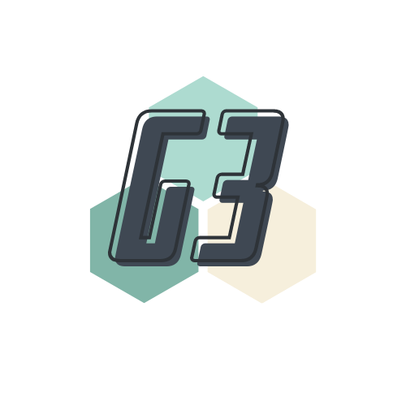

# 🕹Games 🎲  Groups 👨‍👩‍👧‍👦  Gatherings 📅
___
# [Join the Movement](google.com)

G3 or games, groups, and gatherings is a hub for linking users to their friends and finding the right game to play on game night. Plan it all out before you walk in the door with G3 by ERA
___
## Inspirations
___
People like games.

People got a lot of games.

People like to get together to play games.

People tend to forget to bring the games.

People can't decide which games to play.

Well you don't have to worry about that anymore with our app G3 and out expreience team members
___
## Brought to you by:
___
Erin our scrum and database manager

Ryan our git commander and api manger

Abygaelle our documentarian and designer
___

## Technologies:
___
react

Express

JavaScript

Html

CSS

Node.js

Mongoose

MongoDB

Bootstrap

Heroku

AJAX

JWT

Git
___
## Credits
___
Bighead api

BoardGameAtlas api -add links
___
## Ice Box:
___
Group chat

Private Groups

Invite links

Favorite games

filter games by player and playtime

Random game picker
___
# Notes
add images and emojis

